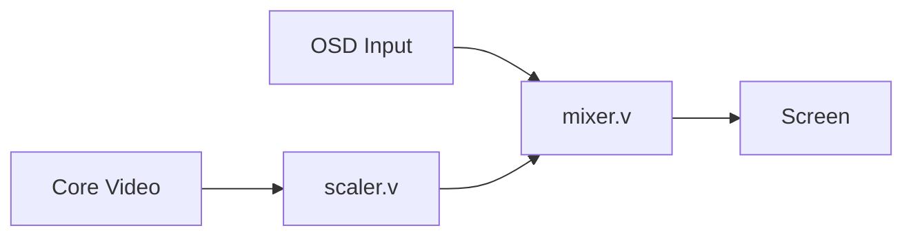
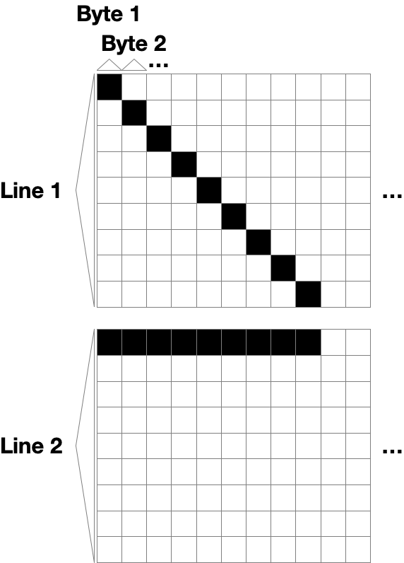

# OSD Buffer

The OSD (the little black and white menu on top of cores) is a line array buffer (more on this later) that shows up when the user use the USER menu button.
It is rendered by the HPS and sent to the FPGA core own OSD module through a bus.

# Video pipeline (simplified)



# OSD Buffer

The OSD memory is laid out as a line character buffer (similar to some OLED displays).
Each line is 256 bytes, with each byte being a vertical 1x8 pixel column.

A simple way to think about it that characters per lines would be rotated 90 degrees.

For example, with the following two lines of pixels:



The buffer would be:

Line 1: `0x01020408102040800000...`

Line 2: `0x01010101010101010000...`

So in order to transform a regular full framebuffer into a line array buffer, a transposition must be made for each character line individually.

# Title Line

The title line of the OSD are lines 16, 17 and 18 (0-indexed), with 16 and 18 being cut off on top and bottom respectively. 

# OSD Buffer Transfer

The transfer is done by using the OSD_CMD_WRITE SPI command using the following pseudo-code:

```javascript
spi_osd_cmd_cont(OSD_CMD_WRITE | line); // Line is from 0..19.
for (i = 0; i < 256; i++) {
    spi_send_word(osd_buffer[line][i]);
}
fpga_spi_en(SSPI_OSD_EN | SSPI_IO_EN | SSPI_FPGA_EN, 0);
```

